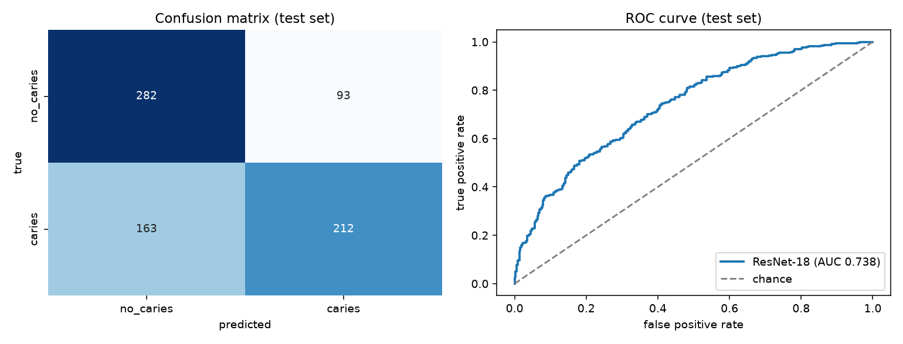
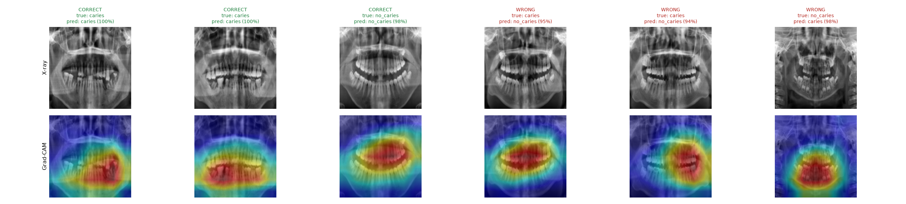
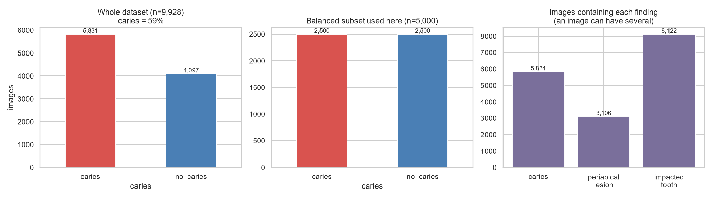
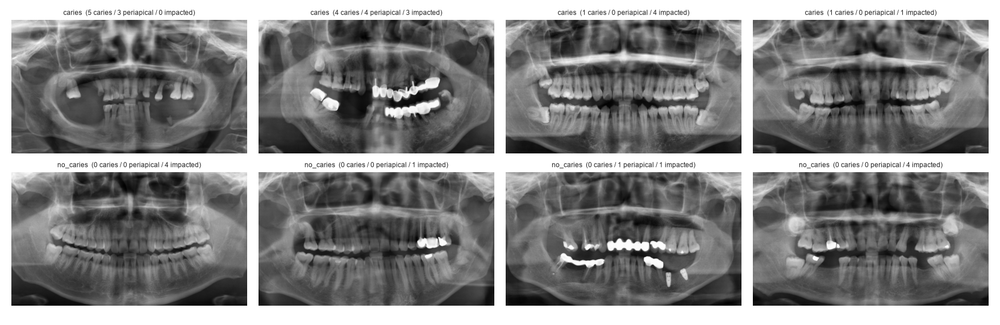
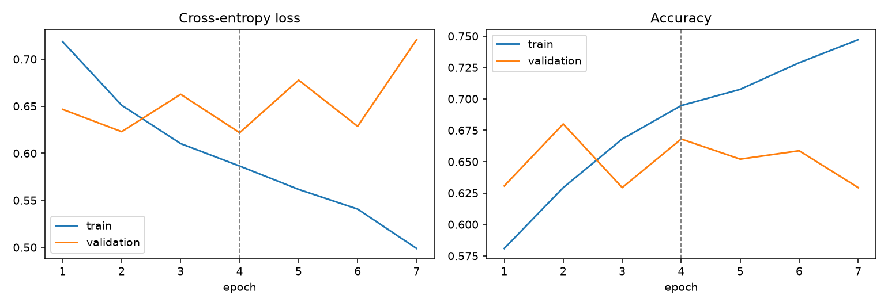

# Dental X-ray Classifier

Deep-learning classifier that looks at a **panoramic dental X-ray** and estimates whether it shows **caries (cavities)**, with **Grad-CAM heatmaps** that show which regions drove each prediction. Built with PyTorch transfer learning (ImageNet ResNet-18), evaluated on a held-out test set with confidence intervals.

**Live demo:** _added after deployment_

> **Educational project. Not a medical device and not for diagnosis.** Results are modest (see below) and the model has only ever seen X-rays that contain at least one finding.

## Results at a glance

Held-out **test set: 750 images** (375 caries, 375 no caries). Never used for training or for choosing the model.

| Metric | Value | 95% CI (bootstrap) |
|---|---|---|
| ROC-AUC | **0.738** | 0.700 – 0.773 |
| Accuracy | **65.9%** | 62.5% – 69.1% |
| Macro F1 | **0.656** | 0.621 – 0.687 |

| Class | Precision | Recall | F1 | Test images |
|---|---|---|---|---|
| `no_caries` | 0.634 | 0.752 | 0.688 | 375 |
| `caries` | 0.695 | 0.565 | 0.624 | 375 |

Confusion matrix (rows = true, columns = predicted): `no_caries` 282 / 93, `caries` 163 / 212.



**How to read this honestly.** The model is clearly better than chance (the AUC interval is far above 0.5) but it is **not a good diagnostic tool**: it misses about 43% of caries images (recall 0.565). Caries are small, and a 1991×1127 panoramic X-ray squeezed into 224×224 pixels loses much of the detail needed to see them. I report it as a solid end-to-end pipeline with a modest result, and list what I would change below, rather than polishing the numbers.

### What the model looks at (Grad-CAM)

The two left columns are correct caries calls, then a correct no-caries call, then the model's most confident mistakes (two missed caries, one false alarm). The heatmaps concentrate on the dentition rather than on image borders or text, which is a basic sanity check that the model is not keying on irrelevant artefacts. Grad-CAM is coarse (7×7 feature map) and is an aid to interpretation, not proof of correct anatomical reasoning. Note that the model is very confident even when wrong, so its probabilities are not calibrated.




### Experiment: does keeping the aspect ratio help?

I suspected that squashing a 1.77:1 panorama into a square was hurting. I retrained the same model on 224×448 inputs (same split, same settings) and evaluated on the same 750 test images:

| Input | ROC-AUC (95% CI) | Accuracy (95% CI) |
|---|---|---|
| 224×224 (used in the demo) | **0.738** (0.700 – 0.773) | 65.9% (62.5 – 69.1) |
| 224×448 (aspect ratio kept) | 0.692 (0.650 – 0.731) | 64.7% (61.2 – 68.1) |

The wider input was **not** better (the intervals overlap but the point estimate is lower), so my hypothesis was not supported and I kept the 224×224 model. Higher resolution on a crop of the teeth, or a stronger model, are the next things I would try. Figures: `results/evaluation_wide.png`, `results/gradcam_wide.png`.

## Data

**Source:** [`liodon-ai/dental-panoramic-xray-yolo`](https://huggingface.co/datasets/liodon-ai/dental-panoramic-xray-yolo) on Hugging Face (CC BY-NC 4.0), which combines [DENTEX](https://huggingface.co/datasets/ibrahimhamamci/DENTEX) and OralXrays-9 (CVPR 2025). It is an **object-detection** dataset: bounding boxes for three findings (caries, periapical lesion, impacted tooth). I turn those boxes into an **image-level classification** task. Public, no login needed.

Three decisions shaped the task, and each came from looking at the data first:

1. **There are no healthy X-rays.** All 9,928 images have at least one annotated finding. So "cavity vs healthy" is impossible with this data. The task is **`caries` (at least one caries box) vs `no_caries`** (other findings only, e.g. impacted wisdom teeth or periapical lesions). The negative class is *not* "healthy".
2. **One source was excluded to avoid a shortcut.** The 678 DENTEX images are 96% caries, versus 56% in OralXrays-9. Mixing them would let a model learn "which scanner/hospital" instead of the disease and inflate the score. Only the 9,250 OralXrays-9 images are used (all exactly 1991×1127).
3. **Balanced subset.** 5,000 images, 2,500 per class (the full data is 59% caries), split **stratified 70 / 15 / 15** into 3,500 train, 750 validation, 750 test, so class ratios hold in every split.





## Approach

1. **Exploratory analysis** (`src/eda.py`): class balance, finding co-occurrence, image sizes, source comparison, sample grid.
2. **Preprocessing**: grayscale, resized to **224×224**, ImageNet mean/std normalisation, replicated to 3 channels.
3. **Augmentation** (training only): left-right flip, rotation up to 10°, small shifts and scale, brightness and contrast jitter. Deliberately mild, since X-ray anatomy is orientation-sensitive.
4. **Model**: ImageNet-pretrained **ResNet-18**, new head (dropout 0.3, then a 2-way linear layer). Layers up to `layer2` are **frozen** and `layer3`, `layer4` and the head are fine-tuned (10.5M of 11.2M parameters). The freeze is mainly because this was trained on a laptop **CPU** (no GPU); it roughly doubled the speed.
5. **Training**: cross-entropy loss, Adam (1e-4 for the backbone, 10× for the head), `ReduceLROnPlateau` scheduler, **early stopping on validation loss** (patience 3). Best epoch was 4 of 7 run.
6. **Evaluation** (`src/evaluate.py`): accuracy, per-class precision / recall / F1, confusion matrix, ROC-AUC, with 1,000-sample bootstrap confidence intervals.
7. **Interpretability** (`src/gradcam.py`, `src/explain.py`): Grad-CAM implemented from scratch.



Training accuracy keeps rising while validation stalls after epoch 4, a normal overfitting pattern on 3,500 images, which is what early stopping is for.

## Limitations

- **Resolution.** Panoramas are 1.77:1 and 1991×1127 pixels; shrinking to 224×224 discards fine detail. I tested the aspect-ratio idea (see the experiment below) and it did **not** help, so the cap is more likely the small input resolution or the label noise than the squashing.
- **Weak labels.** Labels are derived from bounding boxes by other annotators. I did not validate them clinically, so label noise is possible.
- **No patient identifiers.** The dataset gives none, so I cannot guarantee that the same patient is not in both train and test. Scores may be slightly optimistic.
- **Only diseased mouths.** The model has never seen a healthy X-ray, so it must not be read as "healthy vs sick".
- **One source, one task.** Results may not transfer to other scanners or hospitals. Probabilities are uncalibrated.
- **Small CPU-trained model.** No hyperparameter search was done.

## What I would do next

Train at a higher resolution that keeps the aspect ratio, crop to the dentition, use a stronger backbone on a GPU, calibrate probabilities, and evaluate on an external dataset.

## Run it yourself

```bash
python -m venv .venv && source .venv/bin/activate      # Windows: .venv\Scripts\activate
pip install -r requirements.txt

python src/data_prep.py labels      # label files and image-level classes
python src/data_prep.py manifest    # balanced subset and stratified split
python src/data_prep.py images      # downloads ~3.8 GB (5,000 X-rays)
python src/data_prep.py cache       # resize to 224x224 and cache
python src/eda.py                   # charts in results/
python src/train.py --tag square    # ~35 min on an 8-core CPU
python src/evaluate.py --tag square # metrics_square.json + figures
python src/explain.py --tag square  # Grad-CAM figure
python src/app.py                   # Gradio demo at http://127.0.0.1:7860
```

Data is stored outside the repo (`~/ml-data/dental`, override with `DENTAL_DATA_DIR`). The trained weights `models/resnet18_square.pt` (43 MB) are included, so you can run the demo without training.

## Project structure

```
src/
  config.py      paths, image size, seeds, class names
  data_prep.py   download, label derivation, split, cache
  eda.py         exploratory analysis
  dataset.py     PyTorch dataset and augmentation
  model.py       ResNet-18 transfer learning, layer freezing
  train.py       training loop, scheduler, early stopping
  evaluate.py    test metrics, confidence intervals, plots
  gradcam.py     Grad-CAM from scratch
  explain.py     correct and incorrect example figure
  app.py         Gradio demo
results/         figures and metrics (JSON, CSV)
models/          trained weights
```

## Credits and licence

Images: the Hugging Face dataset above (CC BY-NC 4.0), built from DENTEX and OralXrays-9. Non-commercial use; please credit the original authors. Figures in `results/` contain images from that dataset for illustration. Code: MIT, see `LICENSE`.
